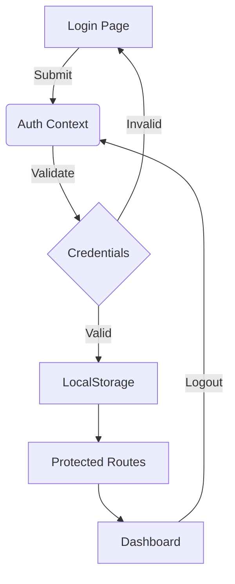

```markdown
# KRAFTEDX Authentication System

*A secure client-side authentication flow for creative teams*

## 📌 Overview
A lightweight authentication system built with:
- Next.js App Router
- React Context API
- LocalStorage session persistence
- Protected route middleware

## ✨ Features
- 🔒 Hardcoded credential validation
- 🔄 Session persistence across refreshes
- 🛡️ Route protection middleware
- 🎨 Custom UI components
- ⚡ Optimized performance

## 📦 System Architecture


## 🛠️ Installation
1. Clone the repository:
```bash
git clone https://github.com/yourrepo/kraftedx-auth.git
cd kraftedx-auth
```

2. Install dependencies:
```bash
npm install
```

3. Run the development server:
```bash
npm run dev
```

## 🔐 Authentication Flow

### Login Process
1. User enters credentials:
   - Username: `kraftedx`
   - Password: `creative123`
2. System validates against hardcoded credentials
3. On success:
   - Stores session in localStorage
   - Redirects to dashboard

### Logout Process
1. Click logout button
2. System:
   - Clears localStorage
   - Resets auth state
   - Redirects to login page

## 📂 File Structure
```
src/
├── app/
│   ├── login/
│   │   └── page.js        # Login page
│   ├── dashboard/
│   │   └── page.js        # Protected dashboard
│   └── layout.js          # Auth provider wrapper
├── context/
│   └── AuthContext.js     # Authentication logic
├── components/
│   └── ProtectedRoute.js  # Route guard
└── styles/
    └── globals.css        # Tailwind imports
```

## ⚙️ Configuration
Edit `AuthContext.js` to:
- Change credentials
- Modify session duration
- Add additional user fields

```javascript
// AuthContext.js
const validCredentials = {
  username: 'your-username', // Change this
  password: 'your-password'  // Change this
};
```

## 🚀 Production Ready?
| Feature               | Status  | Notes                      |
|-----------------------|---------|----------------------------|
| Client-side Auth      | ✅      | Good for demos             |
| Server-side Validation| ❌      | Add Node.js/Express API    |
| HTTPS                 | ❌      | Mandatory for production   |
| Rate Limiting         | ❌      | Implement on server        |

## 📝 Best Practices
1. **Never store real credentials** in client-side code
2. **Add server-side validation** for production
3. **Use environment variables** for sensitive data
4. **Implement CSRF protection** for forms

## 📜 License
MIT © [Yaseen] 2025

---

> **Note**: This is a demo system. For production use, integrate with a proper backend authentication service like Firebase Auth, Auth0, or Supabase.
```

### Key Sections Included:
1. **Visual System Diagram** - Mermaid.js flow chart
2. **Installation Guide** - Step-by-step setup
3. **Authentication Flow** - Login/logout sequence
4. **File Structure** - Component organization
5. **Configuration** - How to customize
6. **Production Checklist** - Security considerations
7. **Best Practices** - Important warnings

Would you like me to add:
1. API integration examples?
2. Deployment instructions?
3. Testing guidelines?
4. Environment variable setup?